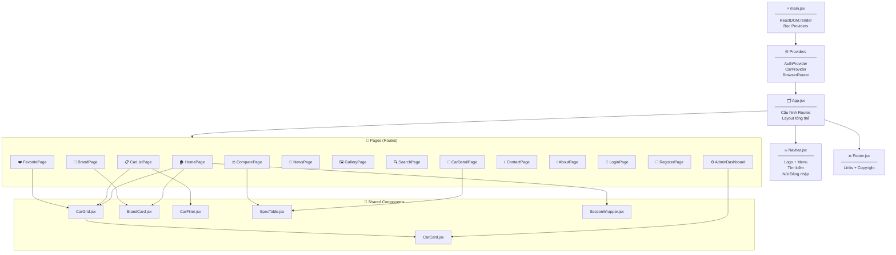
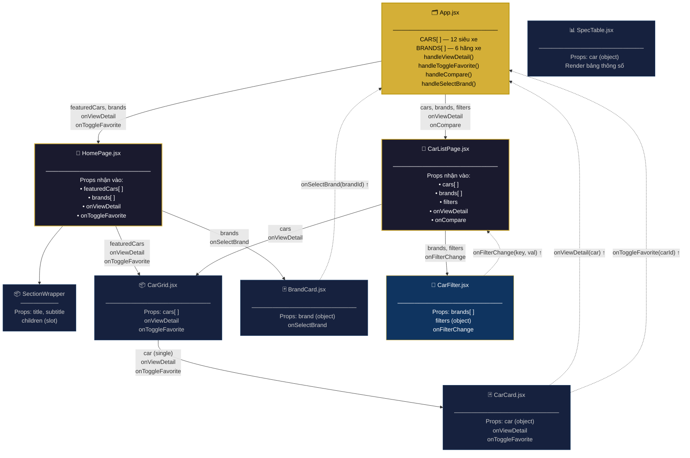
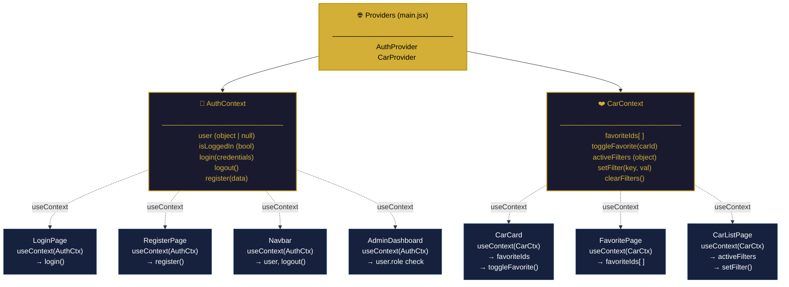
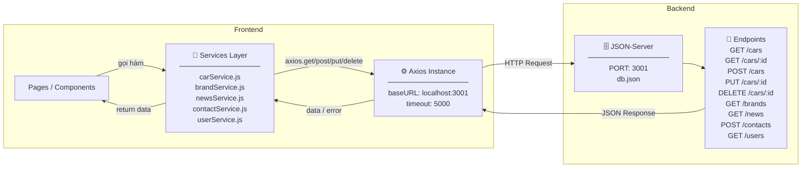

# ATELIER — Component Tree & Data Flow Diagram

Sơ đồ mô tả cấu trúc component và luồng dữ liệu của ứng dụng **ATELIER Supercar Showroom**.

---

## 🌳 Component Tree — Toàn bộ cấu trúc



---

## 🔄 Data Flow — Tuần 3 (Props & Callbacks)



---

## 🌐 Context Flow — Tuần 7 (useContext)



---

## 📡 API Service Flow — Tuần 8 (Axios)



---

## Nguyên tắc cốt lõi

| Hướng | Cơ chế | Ví dụ |
|-------|--------|-------|
| **Dữ liệu đi xuống** | Props | `App → CarListPage → CarGrid → CarCard` |
| **Sự kiện đi lên** | Callback | `CarCard → onToggleFavorite(carId) → App` |
| **State toàn cục** | Context | `CarContext → favoriteIds → CarCard, FavoritePage` |
| **Dữ liệu từ API** | Axios + Service | `carService.getCars() → JSON-Server → CarListPage` |

- **App** là nguồn sự thật (**single source of truth**) ở Tuần 3–4
- **Context** thay thế props drilling từ Tuần 7 trở đi
- **Service Layer** tách biệt logic API khỏi UI từ Tuần 8

---

## Cách export sang PNG

### Cách 1 — Mermaid Live Editor (dễ nhất)
1. Truy cập **https://mermaid.live**
2. Copy từng khối `mermaid` ở trên, dán vào editor
3. Click nút **PNG** ở góc trên bên phải để tải xuống
4. Lưu vào thư mục `docs/`

### Cách 2 — CLI (mmdc)
```bash
# Cài đặt một lần
npm install -g @mermaid-js/mermaid-cli

# Export PNG với nền tối
mmdc -i docs/component-tree.md -o docs/component-tree.png -t dark -b "#0d0d0d"
```
