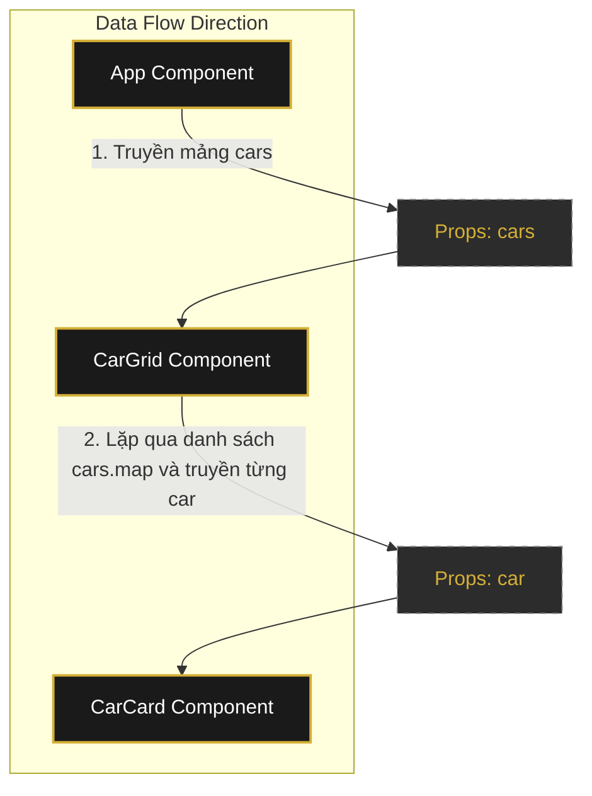

# Data Flow Diagram (Week 3) - Props & Component Communication

This document describes the data flow and props transmission structure from the root component (`App`) down to the individual car card components (`CarCard`).

## Sơ đồ luồng dữ liệu (Data Flow Diagram)



## Mô tả chi tiết luồng truyền Props

1. **Từ `App` xuống `CarGrid`**:
   - Component `App` nắm giữ trạng thái hoặc dữ liệu danh sách xe (`cars`).
   - `App` truyền mảng `cars` này xuống component con là `CarGrid` thông qua thuộc tính (prop) `cars`:
     ```jsx
     <CarGrid cars={cars} />
     ```

2. **Từ `CarGrid` xuống `CarCard`**:
   - `CarGrid` nhận được prop `cars` từ `App`.
   - `CarGrid` sử dụng phương thức `cars.map(car => ...)` để lặp qua danh sách các xe.
   - Với mỗi phần tử `car` trong mảng, `CarGrid` render một component `CarCard` và truyền trực tiếp đối tượng `car` đó cùng với thuộc tính `key` cho `CarCard`:
     ```jsx
     {cars.map((car) => (
       <CarCard key={car.id} car={car} />
     ))}
     ```

## Nguyên lý truyền dữ liệu
- **Unidirectional Data Flow (Luồng dữ liệu một chiều)**: Dữ liệu chỉ được truyền từ component Cha (Parent) xuống component Con (Child) thông qua `Props`. Con nhận dữ liệu dưới dạng Read-only và hiển thị ra giao diện mà không được trực tiếp sửa đổi giá trị của props đó.
